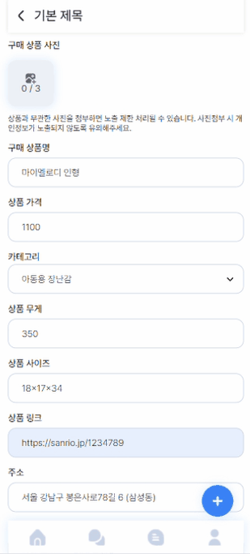
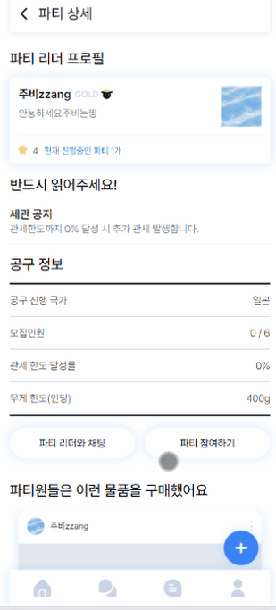
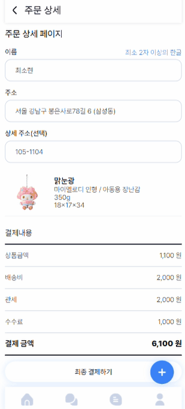
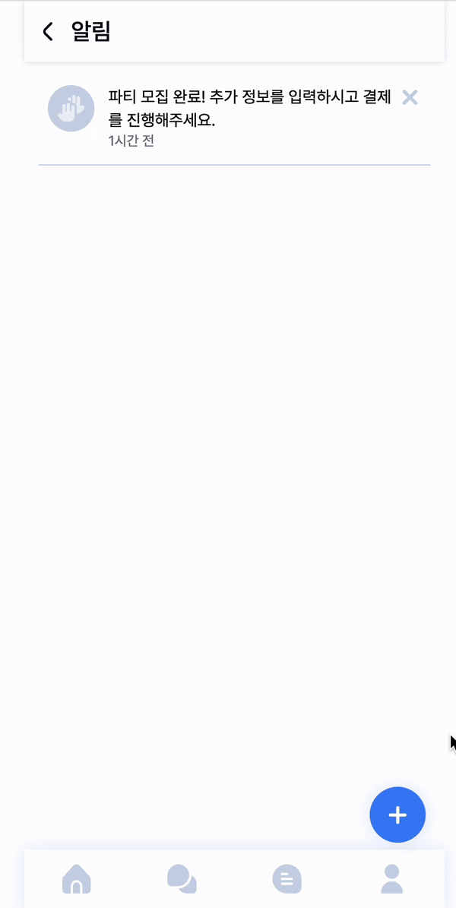

# hexagon-potatoes 🍟

멋쟁이 사자처럼 프론트엔드 스쿨 6조 파이널 프로젝트

<br/>

### 목차

##### 프로젝트 소개

1.[ 서비스 소개](#1-서비스-소개) <br/> 2.[ 사용스택](#2-사용스택)<br/> 3.[ 팀원소개 ](#3-팀원-소개) <br/> 4.[ 발표, 피그마 링크](#4-발표-피그마-링크) <br/> 5.[ 파일 트리](#5-파일트리) <br/> 6.[ 주요 페이지 및 기능](#6-주요-페이지-및-기능)

<hr/>


# 🐑📦 쉽메이트 🐑📦

## 1. 서비스 소개

### Shipmate: 함께 항해하는 글로벌 쇼핑의 동반자

Shipmate는 '해외 배송'을 의미하는 'Ship'과 '동료' 또는 '짝'을 뜻하는 'Mate'를 결합한 이름입니다.
이 이름에는 두 가지 핵심 메시지가 담겨 있습니다:

국경을 넘는 쇼핑 여정: 'Ship'은 전 세계 상품을 향한 항해를 상징합니다.
함께하는 즐거움: 'Mate'는 이 여정을 함께 나누는 동반자를 의미합니다.

Shipmate는 단순한 해외직구를 넘어, 같은 관심사를 가진 사람들이 모여 더 나은 조건으로 글로벌 상품을 구매할 수 있는 플랫폼입니다.

<b>"함께 직구하자, 더 크게 누리자"</b> - 이것이 Shipmate가 추구하는 가치입니다.
<br/>

<br/>

#### <strong>Shipmate</strong>는

더 쉽고 빠른 해외직구를 도와주는 해외직구 공동구매 서비스 입니다.
쉽메이트는 복잡한 해외직구 절차를 <strong>단순화하고, 절감된 배송비로</strong> 해외상품을 구매할수 있도록 지원합니다.
<br/>

### 주요기능

- <b>공동 구매 시스템</b> : ‘n빵’ 방식을 통해 배송비를 분담, 개인 부담 대폭 감소
- <b>자동 관세 계산</b> : 물품 정보 입력 시 관세 자동 계산 기능 제공
- <b>원스톱 배송 서비스</b> : 주문부터 국내 배송까지 전 과정 관리
- <b>파티장 인센티브 프로그램</b> : 공동구매 주최자에게 특별한 혜택 제공
- <b>커뮤니티</b> : 공동구매를 통한 커뮤니티 형성 및 사용자 경험 개선

Shipmate는 해외직구의 진입 장벽을 낮추고, 더 많은 소비자가 글로벌 상품을 쉽고 경제적으로 구매할 수 있는 환경을 조성하는 것을 목표로 합니다

<br/>

## 2. 사용스택

| 카테고리                         | 기술 및 도구                                                                                                                                                                                                                                                                                                                                                                                                                                                                                                                                                                                                                                                         |
| -------------------------------- | -------------------------------------------------------------------------------------------------------------------------------------------------------------------------------------------------------------------------------------------------------------------------------------------------------------------------------------------------------------------------------------------------------------------------------------------------------------------------------------------------------------------------------------------------------------------------------------------------------------------------------------------------------------------- |
| <b>언어</b>                      |                                                                                                                                                                                                                                                                                                                                                                                                                                             |
| <b> 프레임워크 및 라이브러리</b> |       |
| <b>에디터 및 도구</b>            |                                                                                                                                                                                                                                                                                                                |
| <b>AI</b>                        |                                                                                                                                                                                                                                                                                                                                                                                                                                                                                                                                                               |
| <b>협업</b>                      |                                                                                                                                                                                                                                                                                                                                                                                                                                                 |
| <b>배포</b>                      |                                                                                                                                                                                                                                                                                                                                                                                                                                                                                                                                                     |
| <b>버전 관리</b>                 |                                                                                                                                                                                                                                                                                                                                                                                                                                                                                                                                                               |
| <b>패키지 관리</b>               |                                                                                                                                                                                                                                                                                                                                                                                                                                                                                                                                                            |
| <b>데이터 베이스</b>             |                                                                                                                                                                                                                                                                                                                                                                                                                                                                                                                                                        |
| <b>디자인 도구</b>               |                                                                                                                                                                                                                                                                                                                                                                                                                                                                                                                                                           |

<br/>

## 3. 팀원 소개

| 조장 안재명 <br/> <a href="https://github.com/A-Jamong"></a> | 스크럼마스터 최소현<br/><a href="https://github.com/minimumchoi"></a> | 디자인마스터 유진 <br/><a href="https://github.com/jinjintv"></a> | 코딩마스터 정주비<br/><a href="https://github.com/JubiJung"></a> |
| ----------------------------------------------------------------------------------------------------------------------------------------------------------------- | -------------------------------------------------------------------------------------------------------------------------------------------------------------------------- | ---------------------------------------------------------------------------------------------------------------------------------------------------------------------- | --------------------------------------------------------------------------------------------------------------------------------------------------------------------- |
|                                                                                                                                       |                                                                                                                                 |                                                                                                                                            |                                                                                                                                      |

<br/>

## 4. 발표, 피그마 링크

[💚 발표자료]()

[🩵 피그마링크](https://www.figma.com/design/Vq7P8yJgJS8YUrCj2wxjRX/6%EC%A1%B0-%ED%94%BC%EA%B7%B8%EB%A7%88?node-id=0-1&t=tGankYaHKHX9HNXI-1)

[💙 배포링크](https://sheepmate.netlify.app/)

## 5. 파일트리

<details>
<summary>파일트리 펼쳐서 보기</summary>

```
📦src
 ┣ 📂api
 ┃ ┣ 📜auth.ts
 ┃ ┣ 📜createUser.ts
 ┃ ┣ 📜getBestUserRandom.ts
 ┃ ┣ 📜getFieldValueByField.ts
 ┃ ┣ 📜getPartyByKeyword.ts
 ┃ ┣ 📜getPartyByUserId.ts
 ┃ ┣ 📜getPartyNameByLeaderName.ts
 ┃ ┣ 📜getPartyNameByUserId.ts
 ┃ ┣ 📜getTip.ts
 ┃ ┣ 📜getUserById.ts
 ┃ ┣ 📜getUserIdByNickName.ts
 ┃ ┗ 📜index.js
 ┣ 📂components
 ┃ ┣ 📂AddImage
 ┃ ┃ ┗ 📜AddImage.tsx
 ┃ ┣ 📂AgreeTo
 ┃ ┃ ┣ 📜AgreeTo.tsx
 ┃ ┃ ┗ 📜CheckList.tsx
 ┃ ┣ 📂Alert
 ┃ ┃ ┗ 📜Alert.tsx
 ┃ ┣ 📂Buttons
 ┃ ┃ ┣ 📜Button.tsx
 ┃ ┃ ┣ 📜MiniButton.tsx
 ┃ ┃ ┣ 📜ReloadButton.tsx
 ┃ ┃ ┗ 📜SelectCountryButton.tsx
 ┃ ┣ 📂CommunityNav
 ┃ ┃ ┣ 📜CommunityNav.tsx
 ┃ ┃ ┗ 📜CommunityNavList.tsx
 ┃ ┣ 📂DefaultProfileSVG
 ┃ ┃ ┗ 📜DefaultProfileSVG.tsx
 ┃ ┣ 📂Dropdown
 ┃ ┃ ┣ 📜Dropdown.tsx
 ┃ ┃ ┗ 📜DropdownList.tsx
 ┃ ┣ 📂FileInput
 ┃ ┃ ┗ 📜FileInput.tsx
 ┃ ┣ 📂HashtagInput
 ┃ ┃ ┗ 📜HashtagInput.tsx
 ┃ ┣ 📂HeaderBar
 ┃ ┃ ┗ 📜HeaderBar.tsx
 ┃ ┣ 📂Inputs
 ┃ ┃ ┣ 📜AddressInput.tsx
 ┃ ┃ ┣ 📜EmailInput.tsx
 ┃ ┃ ┣ 📜IdInput.tsx
 ┃ ┃ ┣ 📜NickNameInput.tsx
 ┃ ┃ ┣ 📜PhoneNumberInput.tsx
 ┃ ┃ ┣ 📜PwdConfirmInput.tsx
 ┃ ┃ ┣ 📜PwdInput.tsx
 ┃ ┃ ┣ 📜StandardInput.tsx
 ┃ ┃ ┗ 📜UserNameInput.tsx
 ┃ ┣ 📂Label
 ┃ ┃ ┣ 📜Label.tsx
 ┃ ┃ ┗ 📜LabelList.tsx
 ┃ ┣ 📂Lists
 ┃ ┃ ┣ 📜Article.tsx
 ┃ ┃ ┣ 📜BestPartyLeaderRandom.tsx
 ┃ ┃ ┣ 📜BestPartyRandom.tsx
 ┃ ┃ ┣ 📜Item.tsx
 ┃ ┃ ┣ 📜ItemList.tsx
 ┃ ┃ ┣ 📜PartyArticleList.tsx
 ┃ ┃ ┣ 📜PartyLeader.tsx
 ┃ ┃ ┣ 📜PartyLeaderList.tsx
 ┃ ┃ ┣ 📜RandomTip.tsx
 ┃ ┃ ┣ 📜Standard.tsx
 ┃ ┃ ┣ 📜StandardList.tsx
 ┃ ┃ ┗ 📜TipArticleList.tsx
 ┃ ┣ 📂LoginNavi
 ┃ ┃ ┗ 📜LoginNavi.tsx
 ┃ ┣ 📂Magazine
 ┃ ┃ ┣ 📜Magazine.tsx
 ┃ ┃ ┗ 📜MagazineList.tsx
 ┃ ┣ 📂MypageNoticeList
 ┃ ┃ ┗ 📜MypageNoticeList.tsx
 ┃ ┣ 📂MyprofileFollower
 ┃ ┃ ┗ 📜MyprofileFollower.tsx
 ┃ ┣ 📂NameCard
 ┃ ┃ ┗ 📜NameCard.tsx
 ┃ ┣ 📂NavigationBar
 ┃ ┃ ┣ 📜FloatingMenu.tsx
 ┃ ┃ ┗ 📜NavigationBar.tsx
 ┃ ┣ 📂NotificationList
 ┃ ┃ ┗ 📜NotificationList.tsx
 ┃ ┣ 📂PartyInfo
 ┃ ┃ ┣ 📜PartyInfo.tsx
 ┃ ┃ ┗ 📜PartyInfoList.tsx
 ┃ ┣ 📂PartyResult
 ┃ ┃ ┗ 📜PartyResult.tsx
 ┃ ┣ 📂Payment
 ┃ ┃ ┣ 📜Card.tsx
 ┃ ┃ ┣ 📜Payment.tsx
 ┃ ┃ ┗ 📜PaymentListItem.tsx
 ┃ ┣ 📂PostActionBar
 ┃ ┃ ┗ 📜PostActionBar.tsx
 ┃ ┣ 📂PostingCard
 ┃ ┃ ┣ 📜MiniPostingCard.tsx
 ┃ ┃ ┣ 📜PostingCard.tsx
 ┃ ┃ ┣ 📜PostingRandom.tsx
 ┃ ┃ ┗ 📜SquarePostingCard.tsx
 ┃ ┣ 📂RatingStar
 ┃ ┃ ┣ 📜RatingStar.tsx
 ┃ ┃ ┗ 📜Star.tsx
 ┃ ┣ 📂Review
 ┃ ┃ ┗ 📜Review.tsx
 ┃ ┣ 📂SavingMoneyCard
 ┃ ┃ ┗ 📜SavingMoneyCard.tsx
 ┃ ┣ 📂SearchBar
 ┃ ┃ ┣ 📜GoSearch.tsx
 ┃ ┃ ┗ 📜SearchBar.tsx
 ┃ ┣ 📂SimpleLogin
 ┃ ┃ ┗ 📜SimpleLogin.tsx
 ┃ ┣ 📂ToggleSwitch
 ┃ ┃ ┗ 📜ToggleSwitch.tsx
 ┃ ┣ 📂shipstate
 ┃ ┃ ┗ 📜Shipstate.tsx
 ┃ ┗ 📜LoadingSpinner.tsx
 ┣ 📂hooks
 ┃ ┣ 📜index.js
 ┃ ┣ 📜useFetch.ts
 ┃ ┗ 📜useHeaderConfig.ts
 ┣ 📂layout
 ┃ ┣ 📜FocusTrap.tsx
 ┃ ┣ 📜Modal.tsx
 ┃ ┣ 📜RootLayout.tsx
 ┃ ┗ 📜index.js
 ┣ 📂pages
 ┃ ┣ 📂Community
 ┃ ┃ ┣ 📜Community.tsx
 ┃ ┃ ┣ 📜CommunityHome.tsx
 ┃ ┃ ┣ 📜Following.tsx
 ┃ ┃ ┣ 📜Magazine.tsx
 ┃ ┃ ┣ 📜PopularPost.tsx
 ┃ ┃ ┣ 📜RecommendFeed.tsx
 ┃ ┃ ┗ 📜UserTip.tsx
 ┃ ┣ 📂Posting
 ┃ ┃ ┣ 📜BlogPosting.tsx
 ┃ ┃ ┣ 📜BoastDetail.tsx
 ┃ ┃ ┣ 📜InstaPosting.tsx
 ┃ ┃ ┣ 📜MagazineDetail.tsx
 ┃ ┃ ┣ 📜TipDetail.tsx
 ┃ ┃ ┗ 📜WritePost.tsx
 ┃ ┣ 📜AccountSettings.tsx
 ┃ ┣ 📜Announcements.tsx
 ┃ ┣ 📜BlockedUsers.tsx
 ┃ ┣ 📜ChangeCountry.tsx
 ┃ ┣ 📜ChatHome.tsx
 ┃ ┣ 📜ChatRoom.tsx
 ┃ ┣ 📜ClearCache.tsx
 ┃ ┣ 📜DoNotDisturbSettings.tsx
 ┃ ┣ 📜EmptyPage.tsx
 ┃ ┣ 📜ErrorPage.tsx
 ┃ ┣ 📜HomePage.tsx
 ┃ ┣ 📜JoinParty.tsx
 ┃ ┣ 📜Landing.tsx
 ┃ ┣ 📜Login.tsx
 ┃ ┣ 📜MyPage.tsx
 ┃ ┣ 📜MyProfile.tsx
 ┃ ┣ 📜NotificationSettings.tsx
 ┃ ┣ 📜Notifications.tsx
 ┃ ┣ 📜OrderDetail.tsx
 ┃ ┣ 📜OtherSettings.tsx
 ┃ ┣ 📜PartyCollect.tsx
 ┃ ┣ 📜PartyDetail.tsx
 ┃ ┣ 📜PartyList.tsx
 ┃ ┣ 📜PaymentDetail.tsx
 ┃ ┣ 📜PersonalInfoEdit.tsx
 ┃ ┣ 📜ProfileEdit.tsx
 ┃ ┣ 📜Search.tsx
 ┃ ┣ 📜SearchResult.tsx
 ┃ ┣ 📜Setting.tsx
 ┃ ┣ 📜SignUp.tsx
 ┃ ┣ 📜Tutorial.tsx
 ┃ ┣ 📜UpdateVersion.tsx
 ┃ ┣ 📜Withdraw.tsx
 ┃ ┗ 📜index.js
 ┣ 📂styles
 ┃ ┣ 📜global.css
 ┃ ┗ 📜tailwind.css
 ┣ 📂utils
 ┃ ┣ 📜checkDuplicate.ts
 ┃ ┣ 📜currencyFormat.ts
 ┃ ┣ 📜dateFormatter.ts
 ┃ ┣ 📜formatRelativeTime.ts
 ┃ ┣ 📜getLastPath.ts
 ┃ ┣ 📜getPbImageURL.ts
 ┃ ┣ 📜getRandomItems.ts
 ┃ ┣ 📜index.js
 ┃ ┣ 📜pocketbase.ts
 ┃ ┣ 📜seperateTextAndImages.ts
 ┃ ┗ 📜validate.ts
 ┣ 📜App.tsx
 ┣ 📜main.tsx
 ┣ 📜router.tsx
 ┗ 📜vite-env.d.ts
```

</details>

<br/>

## 6. 주요 페이지 UI 및 기능


### 🐑 튜토리얼 및 랜딩🐑

| 튜토리얼                                                                         | 랜딩                                                                             |
| -------------------------------------------------------------------------------- | -------------------------------------------------------------------------------- |
|  |  |

#### 튜토리얼

- 스와이퍼
- 과거 로그인 / 튜토리얼 완료 기록이 스토리지에 남았을 경우 스킵

#### 랜딩

- 튜토리얼로 돌아가는 버튼
- 간편 로그인 ( 추후 구현 예정 )

<br/>

### 🐑 회원가입 및 로그인 🐑

| 회원가입                                                                         | 로그인                                                                           |
| -------------------------------------------------------------------------------- | -------------------------------------------------------------------------------- |
|  |  |

#### 로그인

- 실제 유저 정보와 맞을 경우 로그인 > 홈으로

#### 회원가입

- 모든 필드가 유효성 검사, 중복 검사를 거쳐 모두 채워지고 약관 동의 체크 시 회원가입 성공 > 로그인 페이지로

<br/>

### 🐑 홈 🐑

| 네비게이션                                                                       | 매거진 / 국가리스트                                                              | 이달의 우수 파티장 / 추천 파티 / 직구 자랑 / 팁                                  |
| -------------------------------------------------------------------------------- | -------------------------------------------------------------------------------- | -------------------------------------------------------------------------------- |
|  |  |  |

#### 네비게이션

- <b>헤더</b>
  - 뒤로 가기 / 알림 / 알림+설정 세 버전의 헤더
    <br/>
- <b>네비게이션 + 플로팅 네비게이션</b>
  - 파티 모집, 포스팅 작성 페이지 이동
    <br/>
- <b>보이는 화면의 상단, 하단에 고정</b>

<br/>

#### 매거진 / 국가리스트

- <b>매거진</b>
  - 스와이퍼로 구현
  - 메인 컬러로 레이블을 제작, 흰 타이틀 > 가시성 하락 => 대공사
- <b>국가 리스트</b>
  - 나라별 파티 조회

<br/>

#### 이달의 우수 파티장 / 추천 파티 / 직구 자랑 / 팁

- <b>이달의 우수 파티장</b>
  - 평점 4 이상의 파티장 프로필 표시
- <b>추천 파티</b>
  - 평점 높은 파티장들이 모집중인 파티 추천
- <b>직구 자랑 & 팁</b>

  - 커뮤니티에 있는 글 랜덤으로 표시

- <b>새로고침</b>
  - 각각 다른 글을 조회 가능

<br/>

### 🐑 검색 🐑

| 검색                                                                             |
| -------------------------------------------------------------------------------- |
|  |

- <b>검색</b>
  - 파티장 닉네임, 파티 정보, 국가 등을 기준으로 검색
  - 검색 결과를 파티 리스트로 조회 가능
- <b>최근 검색어</b>
  - 로컬 스토리지 활용해 최근 검색한 키워드 표시
  - 클릭시 해당 검색 결과로 이동

<br/>

### 🐑 파티 모집 🐑

| 파티 모집                                           |
| --------------------------------------------------- |
|  |

- <b>input 핸들링</b>
  - input으로 사용자의 데이터를 받아서 DB 업데이트.
  - 필수 input이 채워지지 않으면 버튼 비활성화.
- <b>해당 파티의 리더 정보로 파티를 모집한 유저의 정보를 보여줌.</b>
- <b>파티 모집 페이지에서는 파티 참여 페이지로 바로 이동.</b>
  - 파티 리더가 해당 파티에 바로 참여할 수 있게 함.
  - 파티 참여까지 완료하면 해당 파티의 상세 페이지로 이동.
  - 파티 리더라면 리더와의 채팅 / 파티 참여 버튼 안보이게 함.

<br/>

### 🐑 파티 상세 🐑

| 파티 참여                                        | 채팅                                              |
| ------------------------------------------------ | ------------------------------------------------- |
|  |  |

#### 파티 참여

- <b>input 핸들링</b>
  - input으로 사용자의 데이터를 받아서 DB 업데이트.
  - 필수 input이 채워지지 않으면 버튼 비활성화.
- <b>파티 상세 페이지에서 파티 참여 후 참여한 파티 상세 페이지로 이동.</b>
  - 파티원이 신청한 물건의 리스트를 확인할 수 있음.
  - 파티원의 참여에 따라 파티 정보 업데이트.
  - 인원이 다 차면 참여 버튼 비활성화 및 버튼 텍스트 업데이트.
    <br/>

#### 채팅

- <b>파티 리더와 채팅</b>
  - 파티원이 참여중인 파티의 리더와 채팅을 하려고 할 때, 이미 존재하는 채팅방이 있으면 해당 채팅방으로 이동.
  - 그렇지 않으면 새로운 채팅방을 개설해서 채팅방으로 이동.

<br/>

### 🐑 주문 상세 🐑

| 주문 상세                                          |
| -------------------------------------------------- |
|  |

- <b>주문 상세 및 결제 페이지</b>
  - 파티원이 참여한 파티가 마감되면 결제 알림을 통해 주문 상세 페이지로 이동.
  - 파티원이 구입한 물건의 정보를 반영해서 결제 진행.
  - input에 기존 데이터가 미리 입력되어 있고 결제 단계에서 수정 및 업데이트 할 수 있음.

<br/>

### 🐑 알림 🐑

| 알림                                                 | 결제                                                 |
| ---------------------------------------------------- | ---------------------------------------------------- |
|  |  |

#### 알림

- <b>읽음확인 및 삭제 </b>
  - 알림 확인 시 배경색 전환
  - 삭제 버튼 클릭 시 해당 알림 삭제
- <b>알림과 관련 된 페이지로 연결</b>
  - 결제요청, 주문완료(주문확인), 배송조회 페이지로 연결

#### 결제

- <b>알림 - 주문상세 - 결제로 이동</b>
  - 결제 금액 연결
  - 카드 추가하기 스와이퍼로 구현

<br/>

### 🐑 커뮤니티 🐑

| 커뮤니티 홈                                       | 추천피드 / 팔로잉 / 유저팁 / 매거진               |
| ------------------------------------------------- | ------------------------------------------------- |
|  |  |

#### 커뮤니티 - 홈

- <b> Framer motion </b>
  - Stagger를 사용하여 렌더링 시 아래에서 위로 순차적으로 애니메이션 되는 효과를 추가
- <b>Swiper </b>
  - 유저들의 자랑은 스와이퍼 autoplay 와 navigation을 넣어 자동으로 넘어가며 화살표 아이콘을 통해 유저가 직접 이동할수 있음

<br/>

#### 커뮤니티 - 추천피드 / 팔로잉 / 유저팁 / 매거진

- <b> 레이아웃</b>
  - 추천피드는 인스타그램 모아보기와 같은 그리드 레이아웃으로 구성
  - 유저팁과 매거진은 블로그 형식으로 구성
- <b>유저팁</b>
  - 유저팁은 텍스트와 이미지를 교차 배열
- <b>인기 포스트</b>
  - 인기포스트는 유저들의 자랑 포스팅을 좋아요 수를 기준으로 정렬
- <b>Framer motion </b>
  - 수직으로 스크롤 되는 페이지는 Stagger효과와 스크롤 진행율에 따른 블러처리를 넣어 동적인 느낌 추가

<br/>

### 🐑 포스팅 상세 🐑

| 포스팅 상세                                          |
| ---------------------------------------------------- |
|  |

- <b>Swiper</b>
  - 블로그형 글이 아닌 인스타포스팅 형식의 글은 이미지가 1장 이상일 경우 스와이퍼를 통해 슬라이드 구현
- <b>좋아요 기능 </b>
  - 하단 아이콘에 툴팁 적용
  - 좋아요, 좋아요 취소 기능 추가

<br/>

### 🐑 포스팅 작성 🐑

| 카테고리선택 및 파일추가                          | 해시태그                                          |
| ------------------------------------------------- | ------------------------------------------------- |
|  |  |

- <b>카테고리에 따른 작성폼 변경</b>
  - 유저팁 작성 시 제목란 추가
- <b>이미지 최대 5장 추가 기능</b>
  - 이미지 5장 초과 시 알림메시지 표시
- <b>해시 태그</b>
  - 키워드 입력 후 엔터 키를 누르면 해시태그 추가
  - 삭제버튼 클릭 시 삭제
- <b>필수 필드 입력확인</b>
  - 필수 필드 미 입력시 알림메시지 표시
